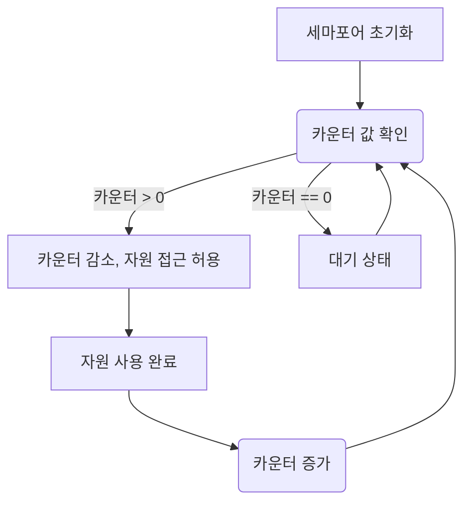

#### 공유된 자원의 데이터는 한 번에 하나의 프로세스만 접근할 수 있도록 제한을 둬야함

**세마포어** : 멀티프로그래밍 환경에서 공유 자원에 대한 접근을 제한하는 방법
- 임계 영역(Critical Section)에 접근하려는 프로세스나 스레드 간의 상호 배제를 보장하는 데 사용
- 기본적으로 **카운터**를 이용해 자원의 접근 가능한 상태를 제어
- 두 가지 주요 연산인 `P` (Wait) 연산과 `V` (Signal) 연산으로 구성

- 카운터같은 경우 초기값을 설정하여 데이터 제한을 둠. 보통 자원의 개수나 제한된 접근 가능 횟수로 설정

> 데이터베이스 연결 제한을 위해 **동시에 최대 3개의 연결**만 허용하려면 세마포어의 초기값을 `3`으로 설정합니다. 카운터가 0이 되면 새 연결을 대기 상태로 만들고, 기존 연결이 해제되면 카운터가 증가해 대기 중인 연결이 활성화됩니다.

**뮤텍스** : 임계 구역을 가진 스레드들의 실행시간이 서로 겹치지 않고 각각 단독으로 실행되게 하는 기술
- 자원을 잠그고 푸는 방식으로 작동
- 단일 스레드만 자원에 접근하도록 함
- [[경쟁 상대(Race Condition)]]를 방지

**데드락과 기아상태가 발생할 수 있다.**
> 두 스레드가 서로 잠금을 기다리면서 영원히 대기하는 데드락이 발생 가능
> 높은 우선순위를 가진 스레드가 자원을 독점하면서 다른 스레드가 자원을 사용하지 못하는 기아 상태가 발생 가능

**단일 자원에 대해 여러 스레드가 경쟁하는 상황**에서 주로 사용

