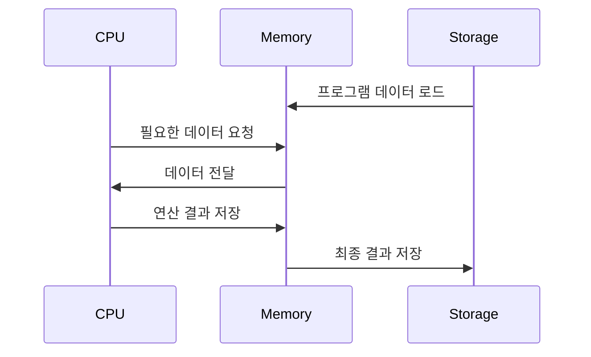

> 메인 메모리는 CPU가 직접 접근할 수 있는 기억 장치
> 프로세스가 실행되려면 프로그램이 메모리에 올라와야함

주소가 할당된 일련의 바이트들로 구성되어 있음

CPU는 레지스터가 지시하는대로 메모리에 접근하여 다음에 수행할 명령어를 가져옴
- 명령어 수행 시 메모리에 필요한 데이터가 없으면 해당 데이터를 우선 가져와여함
- 이 역할이 MMU임
- 


### MMU(Memory Management Unit, 메모리 관리 장치)
- 논리 주소를 물리주소로 변환
- 메모리 보호나 캐시 관리 등 CPU가 메모리에 접근하는 것을 총 관리해주는 하드웨어

메모리의 공간은 한정적임 -> 더 많은 메모리를 제공하기 위해 `가상 메모리`를 활용

*가성 주소에서 실제 데이터가 담겨 있는 곳에 접근하기 위해선 빠른 주소변환이 필요한데, 이를 MMU가 도와주는 것*

>MMU가 지원되지 않으면, 물리 주소를 직접 접근해야함 -> 큰 부담
>MMU는 사용자가 기억장소를 일일이 할당해야하는 불편 해소
>프로세스의 크기가 실제 메모리의 용량을 초과해도 실행되게끔 함


*메인 메모리의 직접 접근은 비효율적이므로,  CPU와 메인 메모리 속도를 맞추기 위해 캐시가 존재*


#### MMU의 메모리 보호
>프로세스는 독립적인 메모리 공간을 가져야함. 자신의 공간만 접근해야함
>따라서 한 프로세스에게 합법적인 주소 영역을 설정, 잘못 접근이 오면 Trap을 발생시키며 보호

##### base와 limit 레지스터를 활용한 메모리 보호 기헙

**base 레지스터는 메모리상의 프로세스 시작주소를 물리 주소로 저장 limit 레지스터는 프로세스의 사이즈를 저장**

```C
base <= x < base+limit
```

영역 밖에서 접근을 요구 -> trap 발생


# 메모리 과할당 (Over Allocating)

> 실제 메모리보다 큰 사이즈의 메모리를 프로세스에 할당한 상황

프로그램이 실제 사용하지 않는 메모리까지 할당받아 자원을 낭비하는 문제를 야기

- **페이지 기법**: 가상 메모리를 활용하여 사용자가 인식하지 못하게 메모리를 할당
- **문제 상황**: 메모리 부족 시 페이지 폴트가 발생하여 사용자에게 과할당이 드러날 수 있음

---

## 페이지 폴트 처리 과정

1. **페이지 폴트 발생**: 프로세스 실행 도중 참조하려는 페이지가 메모리에 없는 경우
2. **디스크에서 페이지 찾기**: 페이지 폴트를 발생시킨 페이지 위치를 디스크에서 찾음
3. **빈 프레임 확인**: 빈 프레임이 있으면 사용하고, 없으면 **victim 페이지**를 swap out

> 페이지 교체로 인한 성능 저하를 줄이기 위해, 디스크 접근 횟수를 최소화해야 함

---

## 메모리 과할당 해결 방안

### 1. Swapping 기법 활용
- **프로세스 swap out**: 메모리에 있는 프로세스 중 하나를 디스크로 내리고 빈 프레임 확보
- **사용자 인지 방지**: 페이징 기법으로 메모리 관리 상황을 사용자에게 드러나지 않게 해야 함

### 2. 페이지 교체 (Page Replacement)
- **빈 프레임 없는 경우**: victim 프레임 선정 후 디스크에 기록하고, 페이지 테이블 업데이트
- **사용자 모르게 교체**: 프로세스를 중단 없이 실행하여 페이지 교체를 감춤

---

## 오버헤드 감소 방법

> 페이지 교체가 잦아지면 디스크 입출력이 늘어 오버헤드 발생

### 1. Dirty Bit 활용
- **변경 비트(Dity Bit)**: 페이지가 수정되었는지 여부를 나타내는 비트
  - 비트가 `set` 상태면 디스크에 기록, `clear` 상태면 기록 불필요
  - 디스크 기록 횟수를 줄여 오버헤드를 절반으로 감소

### 2. 적합한 페이지 교체 알고리즘 선택
- **페이지 교체 알고리즘**: 현재 상황에서 페이지 폴트가 최소화될 수 있는 교체 방식 사용
  - **FIFO**, **OPT**, **LRU** 등 다양한 알고리즘 중 적합한 방식 선택

---

## 캐시 메모리

> 주기억장치와 CPU 간 속도 차이로 인한 성능 저하를 방지하기 위해 사용

자주 참조되는 데이터를 캐시에 저장하여 메모리 접근 및 인출 비용을 줄입니다.
- **구성**: 빠른 속도의 SRAM으로 이루어져 DRAM보다 빠름

---

## CPU와 기억장치의 상호작용

1. **Hit**: CPU가 원하는 데이터가 캐시에 있을 때
   - **처리**: 캐시에서 데이터를 가져와 CPU로 전달
2. **Miss**: 캐시에 데이터가 없는 경우
   - **처리**: 주기억장치에서 데이터를 불러와 캐시에 저장 후 CPU로 전달

> 캐시 적중률을 높이기 위해, **지역성 원리**를 활용하여 필요한 데이터가 캐시에 적절히 저장되도록 관리

---

## 지역성의 원리 (Principle of Locality)

> CPU가 참조할 데이터를 예측하여 캐시 적중률을 높이기 위한 메모리 접근 특성

- **시간 지역성**: 최근 참조된 데이터가 다시 참조될 가능성 높음
- **공간 지역성**: 참조된 데이터의 인접한 데이터가 다시 참조될 가능성 높음

---

## 캐싱 라인

> 캐시에 데이터를 저장할 때 자료구조로 묶어 저장하여 필요한 데이터를 빠르게 찾을 수 있게 하는 방식

캐시에 저장되는 데이터의 메모리 주소를 함께 저장하여 빠르게 접근 가능
- **예시**: set이나 map 구조를 활용하여 필요한 데이터를 빠르게 찾음

> 효율적인 캐싱을 통해 성능을 최적화

