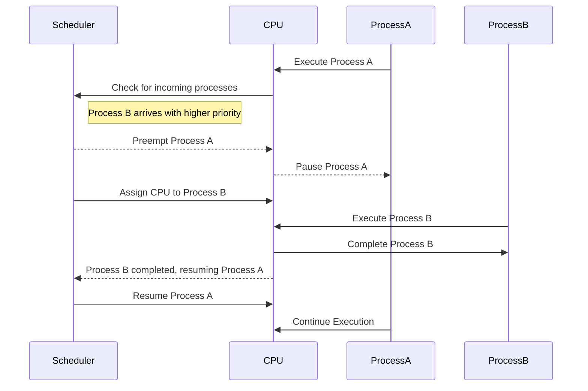
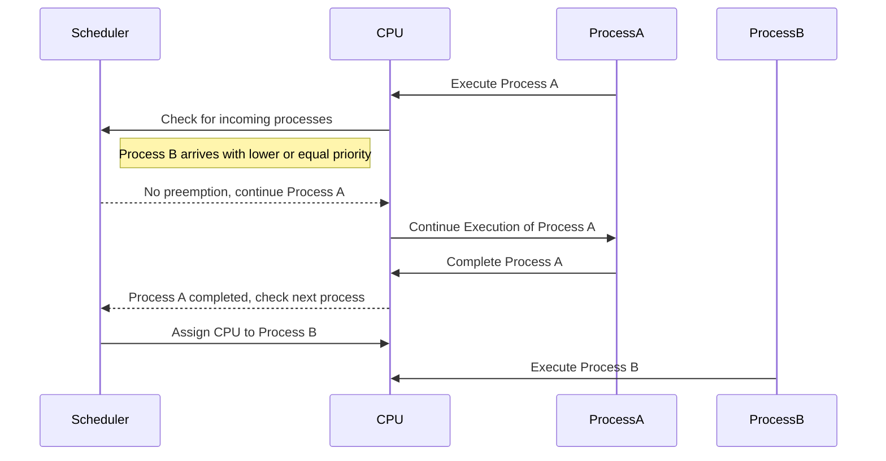

스켸줄링이란?
- 계획된 순서나 시간에 따라 일정한 작업을 배치하고 조정하는 과정

#### CPU Scheduling의 목표
> CPU 스케줄링의 주요 목적은 가능한 한 많은 작업이 동시에 실행되도록 하는 것입니다.
  오버헤드 ↓ / 사용률 ↑ / 기아 현상 ↓
- CPU 이용률 극대화
	- 쉬지 않고 프로세스를 처리 -> 시스템 전체의 생산성을 높이고 대기 시간을 줄임
- 공정성 보장
	- 모든 프로세스가 공정하게 CPU 사용 기회를 얻도록함
	- 특정 프로세스가 과도하게 기다리거나 무시하는 상황 방지
- 처리량 증가
	- 단위 시간당 완료되는 작업의 수를 높임

#### 선점 / 비선점 스케줄링
- **선점(preemptive)** 
	- OS가 CPU의 사용권을 선점할 수 있는 경우, 강제 회수하는 경우
	- ==처리시간 예측이 어려움==
- **비선점** 
	- 프로세스 종료 or I/O 등의 이벤트가 있을 때 까지 실행 보장
	- ==처리시간 예측 용이함==

---

> 선점 스케줄링
> OS가 CPU의 사용권을 선점, 강제 회수하는 경우

- **Process A**가 실행 중인 상황에서 **CPU**가 `Process A`를 실행
- **Scheduler**는 새로운 프로세스 도착 여부를 확인하며, **Process B**가 도착하여 **Process A**보다 높은 우선순위를 가지고 있음을 인지합니다.
- **Scheduler**는 **CPU**에 선점 요청을 보내고, **CPU**는 **Process A**를 일시 중단합니다.
- **Scheduler**는 **Process B**를 **CPU**에 할당하고, **Process B**가 실행을 시작합니다.
- **Process B**가 완료되면 **Scheduler**는 **Process A**의 작업을 재개하도록 **CPU**에 지시합니다.

> 비선점 스켸줄링
> 프로세스 종료 or I/O 등의 이벤트가 있을 때 까지 실행 보장
> 처리시간 계산이 용이함

- **Process A**가 CPU에서 실행을 시작
- **Scheduler**는 새로운 프로세스의 도착 여부를 확인하며, **Process B**가 도착
- **Scheduler**는 비선점 정책에 따라 **Process B**의 우선순위를 고려하지 않고 **Process A**의 실행을 계속
- **Process A**가 완료될 때까지 **Process B**는 대기
- **Process A**가 종료된 후, **Scheduler**는 **CPU**를 **Process B**에 할당하여 실행을 시작

#### CPU  스켸줄링의 종류

비선점 스켸줄링

1. FCFS (First Come First Served)
    - 큐에 도착한 순서대로 CPU 할당
    - 실행 시간이 짧은 게 뒤로 가면 평균 대기 시간이 길어짐
2. SJF (Shortest Job First)
    - 수행시간이 가장 짧다고 판단되는 작업을 먼저 수행
    - FCFS 보다 평균 대기 시간 감소, 짧은 작업에 유리
3. HRN (Hightest Response-ratio Next)
    - 우선순위를 계산하여 점유 불평등을 보완한 방법(SJF의 단점 보완)
    - 우선순위 = (대기시간 + 실행시간) / (실행시간)

선점 스케줄링

1. Priority Scheduling
    
    - 정적/동적으로 우선순위를 부여하여 우선순위가 높은 순서대로 처리
    - 우선 순위가 낮은 프로세스가 무한정 기다리는 Starvation 이 생길 수 있음
    - Aging 방법으로 Starvation 문제 해결 가능
2. Round Robin
    
    - FCFS에 의해 프로세스들이 보내지면 각 프로세스는 동일한 시간의 `Time Quantum` 만큼 CPU를 할달 받음
        - `Time Quantum` or `Time Slice` : 실행의 최소 단위 시간
    - 할당 시간(`Time Quantum`)이 크면 FCFS와 같게 되고, 작으면 문맥 교환 (Context Switching) 잦아져서 오버헤드 증가
3. Multilevel-Queue (다단계 큐)

