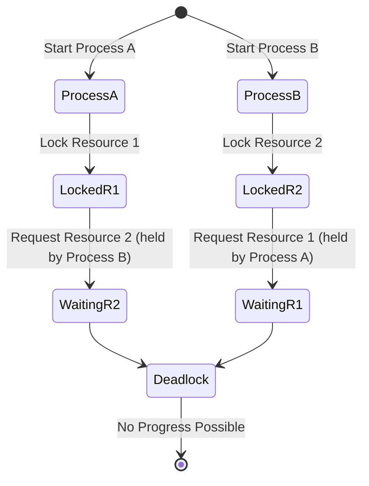

> 두 개 이상의 프로세스나 스레드가 서로 자원을 얻지 못해서 다음 처리를 하지 못하는 상태

>무한히 다음 자원을 기다리게 되는 상태

- **Process A**가 시작하여 **Resource 1**을 잠급니다.
- **Process B**가 시작하여 **Resource 2**를 잠급니다.
- **Process A**는 **Resource 2**를 요청하며 기다림 상태로 전환됩니다.
- **Process B**는 **Resource 1**을 요청하며 기다림 상태로 전환됩니다.
- 두 프로세스가 서로의 자원을 기다리며 데드락 상태가 됩니다.

---

#### 데드락 발생 조건

- **상호 배제(Mutual Exclusion)**
    - 자원은 한번에 하나의 프로세스만 사용할 수 있어야 합니다.
- **점유 대기(Hold and Wait)**
    - 프로세스가 이미 자원을 점유한 상태에서 추가 자원을 요청하며 기다릴 수 있어야 합니다.
- **비선점(No Preemption)**
    - 프로세스가 점유한 자원은 해당 프로세스가 자발적으로 해제할 때까지 다른 프로세스가 강제로 빼앗을 수 없습니다.
- **순환 대기(Circular Wait)**
    - 자원을 요청하는 프로세스들 사이에 순환적인 대기 관계가 존재해야 합니다.

데드락 처리 방법

- **예방(Prevention)**
    - 데드락 발생 조건 중 하나 이상을 제거
    - 예를 들어, 모든 자원을 한 번에 할당하거나, 자원을 요청할 때 순서를 정해 순환 대기를 막는 방식이 있습니다.
- **회피(Avoidance)**
    - 데드락이 발생할 가능성을 줄이는 방법
    - 자원 상태와 프로세스 요구를 미리 파악하여 안전한 상태에서만 자원을 할당
    - 대표적으로 **[[은행원 알고리즘(Banker's Algorithm)]]**
- **탐지(Detection)**
    - 데드락이 발생하는 것을 허용한 후, 주기적으로 시스템 상태를 검사하여 데드락이 발생했는지 탐지합니다. 데드락이 발견되면 프로세스를 종료하거나 자원을 회수하여 해결합니다.
- **회복(Recovery)**
    - 데드락이 탐지되면 이를 해결하는 방법입니다. 데드락 상태에 있는 프로세스 중 일부를 종료하거나 자원을 강제로 회수하여 데드락을 해소합니다.
